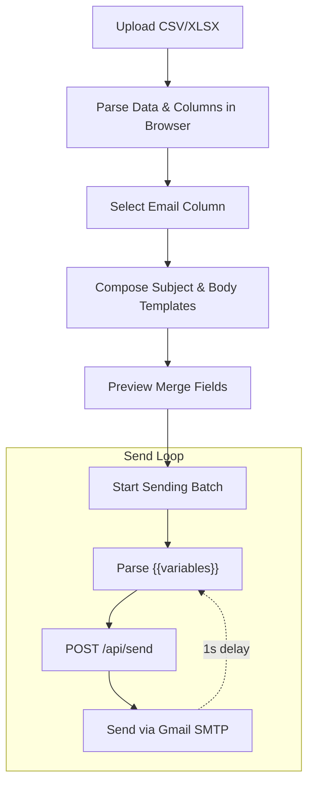
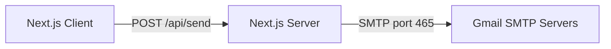

# ✉️ Extremis

A personal bulk-email tool for sending parameterized emails directly through Gmail SMTP.

**Live Demo / Access:** [https://www.extremis.co.in](https://www.extremis.co.in)

[](https://opensource.org/licenses/MIT)

## Table of Contents

1. [What it does](#what-it-does)
2. [How it works](#how-it-works)
3. [Architecture](#architecture)
4. [Tech stack](#tech-stack)
5. [Screenshots](#screenshots)
6. [Getting started](#getting-started)
7. [Usage walkthrough](#usage-walkthrough)
8. [API reference](#api-reference)
9. [Security](#security)
10. [Deployment](#deployment)
11. [Roadmap](#roadmap)
12. [License](#license)

## What it does

Extremis is a specialized tool that lets you:
- Upload a `.csv`, `.xls`, or `.xlsx` file containing recipient data.
- Automatically extract column headers.
- Select which column contains the target email address.
- Write an email subject and body using `{{merge_field}}` placeholders mapped to the column headers.
- Preview the first 5 records to verify merge variable interpolation.
- Send the emails synchronously via `smtp.gmail.com` using a provided Gmail address and App Password.

There is currently no database persistence, no campaign history, and no async task queue.

## ⚙️ How it works



## 🏗️ Architecture



## Tech stack

**Frontend & Backend (Fullstack)**
- `next` (16.2.12 - App Router)
- `react` and `react-dom` (19.2.4)
- `tailwindcss` (^4)
- `shadcn/ui` (Components)
- `papaparse` & `xlsx` (Client-side parsing)
- `nodemailer` (Server-side SMTP)

## Screenshots

*(Place screenshots in `docs/screenshots/` and link them here)*

- **Upload & Column Mapping:** ``
- **Template Composition:** ``
- **Sending Progress:** ``

## Getting started

### Requirements
- Node.js 18+
- A Gmail account with 2-Factor Authentication enabled and an App Password generated.

### Local Setup

**1. Clone the repository**
```bash
git clone https://github.com/Harsh-karn/Extremis.git
cd Extremis/frontend
```

**2. Install Dependencies**
```bash
npm install
```

**3. Set up Environment Variables**
Create a `.env.local` file and set the basic authentication credentials to protect the site from public access.
```bash
BASIC_AUTH_USER=admin
BASIC_AUTH_PASSWORD=your_secure_password
```

**4. Start the application**
```bash
npm run dev
```
Open [http://localhost:3000](http://localhost:3000) (Login with the credentials you set above).

## API reference

### Send Email
- **Endpoint:** `POST /api/send`
- **Payload:** JSON body.

**Example Request:**
```bash
curl -X POST http://localhost:3000/api/send \
  -H "Content-Type: application/json" \
  -d '{
    "gmail_email": "you@gmail.com",
    "gmail_app_password": "your_app_password",
    "subject": "Hello Alice",
    "body": "Your discount is 20%.",
    "to": "user@example.com"
  }'
```
**Response:** JSON indicating success or failure.

## Security

Extremis is a **personal-use tool**, not a multi-tenant SaaS. 
- **Credentials:** Gmail App Passwords are submitted dynamically per request. They are used in memory to establish the SMTP connection and are never saved to a database or written to disk.
- **Client-Side Parsing:** CSV and Excel files are parsed securely in your browser. Contact lists are never uploaded to any server.

## Deployment

The recommended deployment architecture is:
- **Vercel:** Connect the GitHub repository directly to Vercel. 
- Vercel's free tier allows outgoing SMTP connections on port 465 and 587, making it a 100% free hosting solution for this tool without needing a separate backend server.

## Roadmap

The following features are planned but **not yet implemented**:
- **Database Persistence:** Using PostgreSQL to store campaign history, templates, and recipient logs.
- **Multi-Provider Support:** Adding adapters for SES, SendGrid, Mailgun, and Resend.
- **Dashboard & Analytics:** A UI to view past campaigns, open rates, and bounce logs.

## 🤝 Contributing

Contributions are welcome! Since this is primarily a personal tool, please open an issue first to discuss what you would like to change before submitting a Pull Request.

## 📄 License

This project is licensed under the MIT License - see the [LICENSE](LICENSE) file for details.
