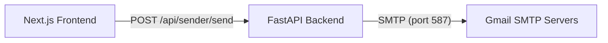

# Extremis

A personal bulk-email tool for sending parameterized emails directly through Gmail SMTP.
**Live Demo / Access:** [https://www.extremis.co.in](https://www.extremis.co.in)

## Table of Contents

1. [What it does](#what-it-does)
2. [How it works](#how-it-works)
3. [Architecture](#architecture)
4. [Tech stack](#tech-stack)
5. [Screenshots](#screenshots)
6. [Getting started](#getting-started)
7. [Usage walkthrough](#usage-walkthrough)
8. [API reference](#api-reference)
9. [Security](#security)
10. [Deployment](#deployment)
11. [Roadmap](#roadmap)
12. [License](#license)

## What it does

Extremis is a specialized tool that lets you:
- Upload a `.csv`, `.xls`, or `.xlsx` file containing recipient data.
- Automatically extract column headers.
- Select which column contains the target email address.
- Write an email subject and body using `{{merge_field}}` placeholders mapped to the column headers.
- Preview the first 5 records to verify merge variable interpolation.
- Send the emails synchronously via `smtp.gmail.com` using a provided Gmail address and App Password.

There is currently no database persistence, no campaign history, and no async task queue.

## How it works

```mermaid
flowchart TD
    A[Upload CSV/XLSX] --> B[Parse Data & Columns]
    B --> C[Select Email Column]
    C --> D[Compose Subject & Body Templates]
    D --> E[Preview Merge Fields]
    E --> F[Trigger Send API]
    
    subgraph Send Loop
    F --> G[Parse {{variables}}]
    G --> H[Send via Gmail SMTP]
    H -. 1s delay .-> G
    end
```

## Architecture



*(Note: While a `docker-compose.yml` exists with PostgreSQL and Redis, they are not currently in the code path or required for the application to function.)*

## Tech stack

**Backend**
- Python 3
- `fastapi[all]`
- `pandas` and `openpyxl` (data parsing)
- `slowapi==0.1.10` (rate limiting)
- `python-multipart`

**Frontend**
- `next` (16.2.12)
- `react` and `react-dom` (19.2.4)
- `tailwindcss` (^4)
- `shadcn` (^4.16.1)
- `lucide-react` (^1.28.0)

## Screenshots

*(Place screenshots in `docs/screenshots/` and link them here)*

- **Upload & Column Mapping:** ``
- **Template Composition:** ``
- **Sending Progress:** ``

## Getting started

### Requirements
- Node.js (for frontend)
- Python 3.8+ (for backend)
- A Gmail account with 2-Factor Authentication enabled and an App Password generated.

### Local Setup

**1. Clone the repository**
```bash
git clone https://github.com/Harsh-karn/Extremis.git
cd Extremis
```

**2. Start the Backend**
```bash
cd backend
python -m venv venv
source venv/bin/activate  # On Windows: venv\Scripts\activate
pip install -r requirements.txt

# Create a .env file based on environment requirements
echo "API_KEY=your_secure_api_key_here" > .env
echo "ALLOWED_ORIGINS=http://localhost:3000" >> .env

# Run the FastAPI server
uvicorn app.main:app --reload --port 8000
```

**3. Start the Frontend**
```bash
cd frontend
npm install

# Create a .env.local file
echo "NEXT_PUBLIC_API_URL=http://localhost:8000" > .env.local
echo "NEXT_PUBLIC_API_KEY=your_secure_api_key_here" >> .env.local

# Run Next.js
npm run dev
```

### Docker Compose
A `docker-compose.yml` file is provided, which currently spins up PostgreSQL and Redis instances (for future roadmap use). To start them:
```bash
docker-compose up -d
```

## Usage walkthrough

**1. Prepare your data**
Create a file named `contacts.csv`:
```csv
Email,FirstName,Discount
user@example.com,Alice,20%
test@example.com,Bob,15%
```

**2. Follow the UI flow**
1. Open the frontend and upload `contacts.csv`.
2. The UI will detect `Email`, `FirstName`, and `Discount`. Select `Email` as the target email column.
3. In the template composer, write your subject and body:
   - **Subject:** `Hey {{FirstName}}, here is your code!`
   - **Body:** `Enjoy {{Discount}} off your next purchase.`
4. View the preview to confirm it renders as: *"Hey Alice, here is your code!"*
5. Input your Gmail address and App Password, then click **Send**.

## API reference

All endpoints are prefixed with `/api/sender` and require the `X-API-Key` header.

### 1. Parse CSV/Excel
- **Endpoint:** `POST /parse-csv`
- **Rate Limit:** 20 requests per minute per IP.
- **Payload:** `multipart/form-data` containing a `file` field.

**Example Request:**
```bash
curl -X POST http://localhost:8000/api/sender/parse-csv \
  -H "X-API-Key: your_secure_api_key_here" \
  -F "file=@contacts.csv"
```

### 2. Send Emails
- **Endpoint:** `POST /send`
- **Rate Limit:** 5 requests per minute per IP.
- **Payload:** JSON body.

**Example Request:**
```bash
curl -X POST http://localhost:8000/api/sender/send \
  -H "X-API-Key: your_secure_api_key_here" \
  -H "Content-Type: application/json" \
  -d '{
    "gmail_email": "you@gmail.com",
    "gmail_app_password": "your_app_password",
    "subject_template": "Hello {{FirstName}}",
    "body_template": "Your discount is {{Discount}}.",
    "email_column": "Email",
    "recipients": [
      {"Email": "user@example.com", "FirstName": "Alice", "Discount": "20%"}
    ]
  }'
```
**Response:** Streams NDJSON (`application/x-ndjson`) showing per-email success or failure.

## Security

Extremis is a **personal-use tool**, not a multi-tenant SaaS. 
- **Authentication:** All backend routes are protected by a static `X-API-Key` header. It is highly recommended to place this backend behind a reverse proxy that provides HTTPS and optionally Basic Auth.
- **Rate Limiting:** IP-based rate limiting (via `slowapi`) is enforced to prevent abuse.
- **Credentials:** Gmail App Passwords are submitted dynamically per request. They are used in memory to establish the SMTP connection and are never saved to a database or written to disk.

## Deployment

The current recommended deployment architecture is:
- **Frontend:** Hosted on Vercel. Connect the GitHub repository directly to Vercel and supply the `NEXT_PUBLIC_API_URL` and `NEXT_PUBLIC_API_KEY` environment variables.
- **Backend:** Hosted on a VPS (e.g., Render, Railway, or standard Linux server). Ensure `ALLOWED_ORIGINS` includes your Vercel domain and `API_KEY` matches the frontend.

## Roadmap

The following features are planned but **not yet implemented**:
- **Async Task Queue:** Utilizing Celery and Redis to decouple email sending from the HTTP request cycle.
- **Database Persistence:** Using PostgreSQL to store campaign history, templates, and recipient logs.
- **Multi-Provider Support:** Adding adapters for SES, SendGrid, Mailgun, and Resend.
- **Dashboard & Analytics:** A UI to view past campaigns, open rates, and bounce logs.

## Contributing

Contributions are welcome! Since this is primarily a personal tool, please open an issue first to discuss what you would like to change before submitting a Pull Request.

## License

*(License file not yet included in repository)*
